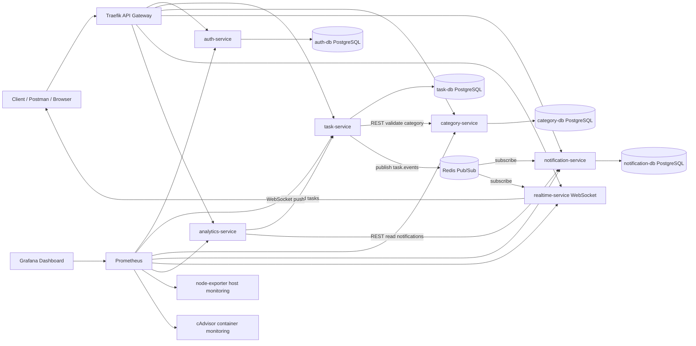

# Desain Arsitektur Microservice

## Use Case

Smart To-Do List Management System membantu user mengelola pekerjaan berdasarkan kategori, prioritas, status, deadline, notifikasi perubahan task, dan ringkasan produktivitas.

## Diagram Keseluruhan



## Service Boundary

| Service | Tanggung Jawab | Database |
| --- | --- | --- |
| auth-service | Register, login, JWT token, profile user | auth-db |
| task-service | CRUD task, status, priority, due date, publish event | task-db |
| category-service | CRUD kategori per user | category-db |
| notification-service | Subscribe task event dan menyimpan notifikasi | notification-db |
| realtime-service | WebSocket gateway untuk update task realtime | - |
| analytics-service | Summary task, overdue, status, dan notifikasi terbaru | - |

## Skema Komunikasi

1. REST API
   - Client mengakses service melalui Traefik.
   - `task-service` memanggil `category-service` untuk validasi kategori.
   - `analytics-service` memanggil `task-service` dan `notification-service` untuk membuat summary.

2. WebSocket
   - Client membuka koneksi ke `ws://localhost/ws?token=JWT`.
   - `realtime-service` memvalidasi JWT lalu mengirim event task secara realtime.

3. Event internal
   - `task-service` publish event `task.created`, `task.updated`, dan `task.deleted` ke Redis Pub/Sub.
   - `notification-service` dan `realtime-service` subscribe channel `task.events`.

## API Gateway

Traefik melakukan routing berbasis path:

| Path | Tujuan |
| --- | --- |
| `/auth/*` | auth-service |
| `/tasks/*` | task-service |
| `/categories/*` | category-service |
| `/notifications/*` | notification-service |
| `/analytics/*` | analytics-service |
| `/realtime`, `/ws` | realtime-service |

## Autentikasi

JWT dibuat oleh `auth-service` saat register/login. Endpoint protected membaca header:

```text
Authorization: Bearer <token>
```

Middleware JWT ada pada service berikut:

- auth-service: `/auth/me`
- task-service: semua endpoint `/tasks`
- category-service: semua endpoint `/categories`
- notification-service: semua endpoint `/notifications`
- analytics-service: `/analytics/summary`
- realtime-service: koneksi `/ws?token=...`

## Monitoring

- Host monitoring: `node-exporter` expose CPU, memory, disk host ke Prometheus.
- Container monitoring: `cadvisor` expose CPU/memory/network per container.
- Application monitoring: semua Node.js service expose `/metrics` dengan `prom-client`.
- Grafana otomatis membaca datasource Prometheus dan dashboard `Smart Todo Microservices`.

## Alur Demo

1. Jalankan semua container dengan `docker compose up --build -d`.
2. Buka dashboard Traefik di `http://localhost:8080` dan tunjukkan router service aktif.
3. Jalankan `scripts/test-endpoints.ps1` untuk membuktikan endpoint bekerja.
4. Buka Prometheus `http://localhost:9090` dan cek target scrape.
5. Buka Grafana `http://localhost:3000`, dashboard `Smart Todo Microservices`.
6. Opsional: buka WebSocket client ke `ws://localhost/ws?token=TOKEN`, lalu buat/update task.
